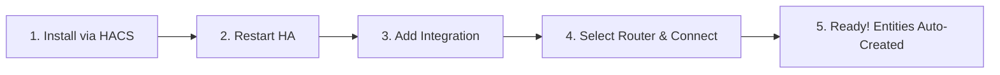

<div align="center">


# WiFiSense Mapper

**Custom Home Assistant integration for WiFi-based room mapping, signal heatmaps, and object/furniture anomaly detection.**

[](https://hacs.xyz)
[](https://www.home-assistant.io)
[](LICENSE)

</div>


WiFiSense Mapper is a **glue layer** — it fuses telemetry from your mesh router, ESP32 CSI sensing nodes, existing Home Assistant Floors & Areas, and optional robot vacuum maps into interactive 2D heatmaps, spatial anomaly detection, and rough room-level device tracking. It does **not** replace ESPectre, TOMMY, your router integration, or Zircon3D/Floorplan. It makes them work together.

---

## Features

| Feature | Description |
|---------|-------------|
| **Router Telemetry** | Connects to TP-Link Deco (local API) or bridges via existing UniFi integrations. |
| **ESP32 CSI Sensing** | Auto-discovers ESPectre and TOMMY nodes via ESPHome or MQTT for device-free motion. |
| **HA-Native Setup** | Automatically maps to your existing Home Assistant Floors and Areas registries. |
| **2D Floor Heatmaps** | Generates 4 visual heatmap layers (Signal, Variance, Motion, Anomaly) as PNG image entities. |
| **Smart Anomaly Detection** | Learns baseline room signal patterns to detect when furniture or large objects are moved. |
| **Room-Level Tracking** | Tracks connected WiFi devices by room based on Access Point association. |
| **Vacuum Map Alignment** | Optional alignment with Roborock, Valetudo, and Dreame map boundaries. |
| **HACS Ready** | Full UI configuration flow, options flow, and custom services. |

---

## What This Is Not

- ❌ A replacement for [ESPectre](https://github.com/francescopace/espectre) or TOMMY firmware
- ❌ A router management UI
- ❌ A camera or computer-vision system (100% privacy-friendly RF sensing)
- ❌ A centimeter-precise GPS tracking system
- ✅ The spatial context layer between your existing Home Assistant devices

---

## Requirements

- **Home Assistant** 2024.1 or newer
- **At least one telemetry source:**
  - **ESP32 CSI nodes** running ESPectre or TOMMY (*strongly recommended for device-free motion & security*)
  - **Mesh router** (TP-Link Deco or UniFi)
- **Recommended:**
  - Floors and Areas configured in Home Assistant (**Settings → Areas & Zones**)
- **Optional:**
  - Robot vacuum with map camera/image entity (Roborock, Valetudo, Dreame)

---

## Installation & Setup



### 1. Install via HACS (Recommended)
1. In HACS, navigate to **Integrations** → **⋮** (top right) → **Custom repositories**.
2. Add `https://github.com/assafmiron/WiFiSense-Mapper` with category **Integration**.
3. Search for **WiFiSense Mapper** and click **Download**.
4. Restart Home Assistant.

### Manual Installation
Alternatively, copy the `custom_components/wifisense_mapper/` directory into your Home Assistant `/config/custom_components/` folder and restart Home Assistant:
```bash
cp -r custom_components/wifisense_mapper /config/custom_components/
```

### 2. Add and Configure Integration
1. Go to **Settings → Devices & Services → Add Integration**.
2. Search for **WiFiSense Mapper**.
3. Follow the simple setup dialog:
   * **TP-Link Deco**: Enter your Deco local IP and admin password (an automatic connection test is performed).
   * **UniFi**: Automatically links via your existing UniFi Home Assistant integration (no credentials needed).
   * **None**: For setups using ESP32 CSI nodes or vacuum maps only.
4. All sensors, presence indicators, and heatmap images will be automatically generated based on your Home Assistant Floors and Areas.

> [!TIP]
> **Helpful Logging Tip**: If you ever need to inspect what WiFiSense Mapper is doing or troubleshoot connection issues, enable debug logging by adding this to your `configuration.yaml`:
> ```yaml
> logger:
>   default: info
>   logs:
>     custom_components.wifisense_mapper: debug
> ```

---

## 📚 Documentation & User Guides

Explore our detailed reference guides for advanced configurations and use cases:

* ⚙️ **[Configuration & Services Guide](docs/configuration.md)** — Step-by-step setup, options flow settings, and automation services.
* 🏷️ **[Entities Reference](docs/entities.md)** — Full list of binary sensors, sensors, image heatmaps, and device trackers.
* 🚨 **[Connecting to HA Security Alarms](docs/security-alarms.md)** — How to use WiFi sensing as an intrusion alarm for Alarmo or Manual Alarm.
* 🛠️ **[Troubleshooting & Calibration Guide](docs/troubleshooting.md)** — Searchable solutions for common issues, node placement tips, and vacuum calibration.
* 📐 **[Technical Details & Architecture](docs/technical-details.md)** — In-depth look at 2D spatial math, IDW interpolation, EWMA baseline algorithms, and Lovelace visualization.

---

## Quick Lovelace Preview

Overlay your live WiFi signal heatmap directly onto your 2D floorplan card:

```yaml
type: picture-elements
image: /local/floorplan.png
elements:
  - type: image
    entity: image.ground_floor_signal_heatmap
    style:
      left: 0%
      top: 0%
      width: 100%
      opacity: 0.6
  - type: state-badge
    entity: binary_sensor.living_room_presence
    style: {left: 30%, top: 40%}
```

---

## Contributing

Contributions, issues, and feature ideas are warmly welcomed! Please read our [Agent & Contributor Guidelines](AGENTS.md) before submitting pull requests.

```bash
pip install -r requirements_test.txt
ruff check custom_components/wifisense_mapper tests/
pytest tests/ -v
```

---

## License

Distributed under the MIT License. See [LICENSE](LICENSE) for details.
