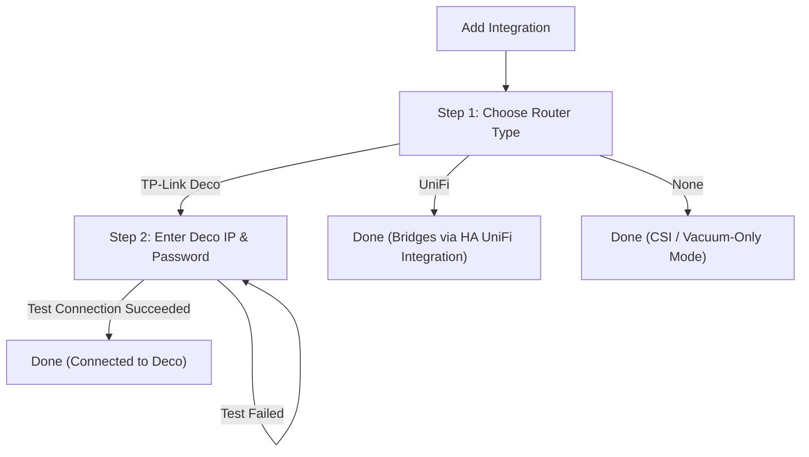

# Configuration & Services Guide

WiFiSense Mapper is designed to be configured entirely via Home Assistant's user interface, with optional YAML services for advanced automations and calibration.

---

## 1. Initial Setup (Config Flow)

When you add WiFiSense Mapper via **Settings → Devices & Services → Add Integration**:



### Step 1: Router Selection
Choose your primary router telemetry source:
- **TP-Link Deco**: Connects directly to the Deco local web API.
- **UniFi**: Automatically bridges through the official Home Assistant UniFi Network integration (no credentials required).
- **None**: Choose this if you only use ESP32 CSI nodes (ESPectre / TOMMY) or vacuum maps.

### Step 2: Deco Credentials (Deco only)
* **Router IP Address / Host**: e.g., `192.168.0.1`
* **Username**: Default is `admin`
* **Password**: Your Deco web interface admin password
* *Note: The setup will automatically perform a live connection test before saving.*

---

## 2. Options Flow (Configuration Settings)

After setup, you can adjust options anytime by going to **Settings → Devices & Services → WiFiSense Mapper → Configure**:

| Setting | Parameter | Default | Range | Description |
|---|---|---|---|---|
| **Poll Interval** | `poll_interval` | `30s` | `10s` – `3600s` | How often router client states and CSI metrics are queried and processed. |
| **Heatmap Generation** | `heatmap_enabled` | `true` | On / Off | Enable or disable 2D PNG heatmap rendering. (Disable on low-power devices if heatmaps are not used). |
| **Anomaly Threshold** | `anomaly_threshold` | `3.0 σ` | `0.5` – `10.0` | Z-score sensitivity for object anomaly detection. Higher = fewer alerts, lower = more sensitive. |
| **Baseline Learning Window** | `baseline_days` | `7 days` | `1` – `30` | Number of days of historical data used for the rolling EWMA signal baseline. |
| **Vacuum Map Entities** | `vacuum_entities` | `[]` | Multi-select | Select camera or image map entities from Roborock, Valetudo, or Dreame integrations. |

---

## 3. Services Reference

All services can be invoked via **Developer Tools → Services** or directly inside HA Automations and Scripts.

### `wifisense_mapper.start_scan` / `wifisense_mapper.stop_scan`
Pause or resume data collection and spatial processing without unloading the integration.

```yaml
service: wifisense_mapper.start_scan
```
```yaml
service: wifisense_mapper.stop_scan
```

---

### `wifisense_mapper.generate_heatmap`
Manually trigger immediate generation of heatmap PNGs for one or all floors.

```yaml
service: wifisense_mapper.generate_heatmap
data:
  floor_id: ground_floor   # Optional: defaults to all floors
  layer: signal            # Optional: signal | variance | motion | anomaly
```

---

### `wifisense_mapper.learn_baseline`
Resets and restarts the rolling signal baseline for a floor. Useful after remodeling, rearranging furniture, or moving WiFi access points.

```yaml
service: wifisense_mapper.learn_baseline
data:
  floor_id: ground_floor   # Optional: defaults to all floors
```

---

### `wifisense_mapper.calibrate_vacuum_map`
Registers 3 or more point correspondences between vacuum map pixel coordinates and WiFiSense grid coordinates to accurately align floorplans.

```yaml
service: wifisense_mapper.calibrate_vacuum_map
data:
  floor_id: ground_floor
  calibration_points:
    - {vac_px: 120, vac_py: 80, grid_col: 4, grid_row: 3}
    - {vac_px: 300, vac_py: 80, grid_col: 10, grid_row: 3}
    - {vac_px: 120, vac_py: 250, grid_col: 4, grid_row: 8}
```

---

### `wifisense_mapper.export_map`
Exports the current heatmap as a PNG image or raw JSON grid data into `/config/www/` for external dashboards or 3D floorplans.

```yaml
service: wifisense_mapper.export_map
data:
  floor_id: ground_floor
  format: png              # png | json
  layer: signal            # signal | variance | motion | anomaly
```
*Files are saved to `/config/www/wifisense_{floor}_{layer}.png` and accessible at `/local/wifisense_{floor}_{layer}.png`.*

---

### `wifisense_mapper.link_node_to_area`
Manually override the automatically detected Home Assistant Area for a specific CSI node or Access Point.

```yaml
service: wifisense_mapper.link_node_to_area
data:
  node_id: "espectre_living_room"
  area_id: "living_room"
```
