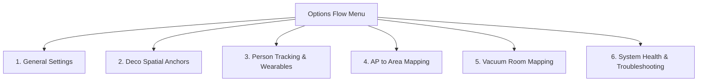

# Configuration & Services Guide

WiFiSense Mapper is designed to be configured entirely via Home Assistant's user interface, with automatic router detection, 1-click zero-credential onboarding, and optional YAML services for advanced automations and calibration.

---

## 1. Initial Setup (Config Flow)

When you add WiFiSense Mapper via **Settings → Devices & Services → Add Integration**:

```mermaid
flowchart TD
    Start["Add Integration"] --> Detect["Auto-Discovery Phase (Scans HA Config Entries)"]
    Detect --> Step1["Step 1: Router Selection"]
    
    Step1 -->|TP-Link Deco Detected — 1-Click Auto Setup| AutoTest["Test Connection with Adopted Credentials"]
    AutoTest -->|Success| FinishDeco["Done (Connected to Deco)"]
    AutoTest -->|Failed| Step2["Step 2: Enter Deco Password (Pre-filled IP)"]
    
    Step1 -->|TP-Link Deco (Manual)| Step2
    Step1 -->|UniFi (Bridge)| FinishUniFi["Done (Bridges via HA UniFi Integration)"]
    Step1 -->|None| FinishCSI["Done (CSI / Vacuum-Only Mode)"]
    
    Step2 -->|Test Connection Succeeded| FinishDeco
    Step2 -->|Test Failed| Step2
```

### Step 1: Router Selection & Auto-Detection
WiFiSense Mapper automatically scans your Home Assistant configuration for existing router integrations:

* **TP-Link Deco (Auto-Detected — 1-Click Setup)**:
  If you already have the TP-Link Deco integration configured in Home Assistant, WiFiSense Mapper detects your Deco mesh hub (e.g. at `192.168.1.246`) and extracts stored credentials. Selecting this option tests connectivity and completes setup immediately in a single click with **zero manual credential entry**.
* **TP-Link Deco (Manual Configuration)**:
  If selected (or if auto-connect needs password confirmation), your detected Deco IP address is automatically pre-filled as the suggested value instead of generic defaults.
* **UniFi (Bridge via HA Integration)**:
  Automatically bridges through the official Home Assistant UniFi Network integration (no credentials required).
* **None (CSI / Vacuum-Only Mode)**:
  Choose this if you only use ESP32 CSI nodes (ESPectre / TOMMY) or vacuum maps.

### Step 2: Deco Credentials (Manual Setup / Fallback)
* **Router IP Address / Host**: Pre-populated with your detected Deco IP (e.g., `192.168.1.246`).
* **Username**: Default is `admin`.
* **Password**: Your Deco web interface admin password.
* *Note: The setup automatically performs a live connection test before saving.*

---

## 2. Extensible Router Architecture (Developer Reference)

WiFiSense Mapper uses an extensible **Router Discovery & Adapter Provider Pattern** located in `custom_components/wifisense_mapper/router_discovery.py`.

Adding support for a new router platform (e.g., AsusWRT, Keenetic, Fritz!Box, OpenWrt, Netgear Orbi) only requires:
1. Creating a `RouterClient` adapter subclass in `custom_components/wifisense_mapper/clients/`.
2. Implementing a `RouterDiscoveryProvider` subclass in `custom_components/wifisense_mapper/router_discovery.py` specifying `target_domains` and metadata extraction rules.
3. Adding the provider to `ROUTER_DISCOVERY_PROVIDERS`.

The onboarding UI and credential adoption will automatically adapt without modifying core coordinator or spatial engine logic.

---

## 3. Options Flow (Configuration Settings)

Once configured, click **Configure** on the WiFiSense Mapper card in **Settings → Devices & Services** to open the interactive settings menu. The options flow is organized into 6 distinct management sections:


```mermaid
flowchart TD
    Menu["Options Flow Menu"] --> General["1. General Settings"]
    Menu --> Anchors["2. Deco Spatial Anchors"]
    Menu --> Person["3. Person Tracking & Wearables"]
    Menu --> APMap["4. AP to Area Mapping"]
    Menu --> VacMap["5. Vacuum Room Mapping"]
    Menu --> Troubleshoot["6. System Health & Troubleshooting"]
```

### 1. General Settings (`general`)
Controls polling cadences, detection algorithms, and sensitivity thresholds:

| Setting | Parameter | Default | Range | Description |
|---|---|---|---|---|
| **RF Motion Sensing** | `rf_sensing_enabled` | `true` | On / Off | Enable device-free RF motion detection using Deco wireless mesh backhauls and stationary Wi-Fi IoT devices. |
| **RF Sensitivity** | `rf_sensitivity` | `medium` | Low / Med / High | Perturbation threshold: `Low` (stricter, large body movement), `Medium` (balanced everyday walking), `High` (subtle motion). |
| **RF Clear Delay** | `rf_off_delay` | `30s` | `5s` – `300s` | Hold-down time of clean signal before `binary_sensor.{area}_rf_motion` clears back to `off`. |
| **Adaptive Fast Polling** | `adaptive_polling` | `true` | On / Off | Automatically bursts polling to 3-second intervals during detected active motion, restoring standard intervals when quiet. |
| **Fast Event Push** | `fast_event_push` | `true` | On / Off | Triggers immediate person localization updates (< 500ms) upon client roaming or CSI motion events without waiting for polling. |
| **Poll Interval** | `poll_interval` | `60s` | `10s` – `3600s` | Background spatial loop interval for baseline learning, vacuum map alignment, and periodic heatmap refresh. |
| **Heatmap Generation** | `heatmap_enabled` | `true` | On / Off | Enable or disable 2D PNG heatmap rendering. (Disable on low-power hosts like Raspberry Pi 3 if heatmaps are not needed). |
| **Anomaly Threshold** | `anomaly_threshold` | `3.0 σ` | `0.5` – `10.0` | Z-score statistical threshold for object anomaly detection. Higher = fewer alerts, lower = more sensitive to displaced obstacles. |
| **Baseline Learning Window** | `baseline_days` | `7 days` | `1` – `30` | Number of days of historical data used for the rolling EWMA signal baseline. |
| **Vacuum Map Entities** | `vacuum_entities` | `[]` | Multi-select | Select camera or image map entities from Roborock, Valetudo, or Dreame integrations. |

---

### 2. Deco Spatial Anchors (`deco_anchors`)
Configure physical router positions to anchor signal models and 2D floorplan heatmaps:
* **Room / Area Selection**: Assign each discovered Deco Access Point to a Home Assistant Area.
* **X Position (%)**: Horizontal placement percentage from the left border of the floor (0%–100%).
* **Y Position (%)**: Vertical placement percentage from the top border of the floor (0%–100%).
* **Vacuum Map Integration**: If robot vacuum map features are parsed, room segments are displayed alongside areas (e.g. `[🧹 Vacuum: Living Room]`) and router coordinates auto-suggest the room's calculated centroid.

---

### 3. Person Tracking & Wearables (`person_tags`)
Map individual WiFi client devices (smartphones, smartwatches, tablets, BLE tags) to Home Assistant `person.*` entities:
* Select any detected WiFi client from the populated device list (with hostnames, MAC addresses, and vendors).
* Assign the client to a Home Assistant Person (e.g., `John (person.john)`).
* Creates unified tracking entities under that Person:
  * `sensor.{person}_location` (Room location, "Away", or transition direction)
  * `sensor.{person}_activity` (`Stationary / Sitting`, `Walking / Moving`, `Room Transitioning`, `Away`)
  * `sensor.{person}_confidence` (Localization confidence score %)
  * `sensor.{person}_dwell_time` (Seconds elapsed in the current room)
  * `device_tracker.{person}_wifi` (Device tracker attached to the person)

---

### 4. AP to Area Mapping (`ap_mapping`)
Directly map mesh router units and Access Points to Home Assistant Areas:
* Assign each AP to an Area from the dropdown menu.
* **Overwrite HA Device Areas (`overwrite_ha_device_areas`)**: When checked, automatically synchronizes Home Assistant's Core Device Registry so the router device itself is assigned to the selected Area.

---

### 5. Vacuum Room Mapping (`vacuum_mapping`)
Link parsed robot vacuum map rooms to Home Assistant Areas:
* Associates vacuum room segment IDs (e.g. Roborock segment 16, 17) with Home Assistant Areas (`living_room`, `kitchen`).
* Enables the spatial engine to constrain signal propagation, clip heatmaps to walls, and automatically compute room centroids for Access Points.

---

### 6. System Health & Diagnostics (`troubleshooting`)
A live diagnostics and troubleshooting dashboard embedded directly inside the Options Flow:
* **Pillow Status**: Displays whether Pillow is active (`✅ Installed (v10.x)`) or if the built-in pure-Python fallback renderer is operating.
* **Router Status**: Real-time connection health (`✅ Connected` vs `⚠️ Disconnected / Not Polled`).
* **Area Coverage Diagnostics**: Summary of RF coverage across your home (e.g., `4/5 Areas Covered (3 Cross-covered)`).
* **Recent Live Logs**: Displays the last 25 coordinator log entries directly within the UI dialog for immediate debugging without needing shell access or log downloads.

---

## 4. Services Reference

All services can be invoked via **Developer Tools → Services** or directly inside HA Automations and Scripts.

### `wifisense_mapper.start_scan` / `wifisense_mapper.stop_scan`
Pause or resume data collection and spatial processing without unloading the integration.

```yaml
service: wifisense_mapper.start_scan
```
```yaml
service: wifisense_mapper.stop_scan
```

---

### `wifisense_mapper.generate_heatmap`
Manually trigger immediate generation of heatmap PNGs for one or all floors.

```yaml
service: wifisense_mapper.generate_heatmap
data:
  floor_id: ground_floor   # Optional: defaults to all floors
  layer: signal            # Optional: signal | variance | motion | anomaly
```

---

### `wifisense_mapper.learn_baseline`
Resets and restarts the rolling signal baseline for a floor. Useful after remodeling, rearranging furniture, or moving WiFi access points.

```yaml
service: wifisense_mapper.learn_baseline
data:
  floor_id: ground_floor   # Optional: defaults to all floors
```

---

### `wifisense_mapper.calibrate_vacuum_map`
Registers 3 or more point correspondences between vacuum map pixel coordinates and WiFiSense grid coordinates to accurately align floorplans.

```yaml
service: wifisense_mapper.calibrate_vacuum_map
data:
  floor_id: ground_floor
  calibration_points:
    - {vac_px: 120, vac_py: 80, grid_col: 4, grid_row: 3}
    - {vac_px: 300, vac_py: 80, grid_col: 10, grid_row: 3}
    - {vac_px: 120, vac_py: 250, grid_col: 4, grid_row: 8}
```

---

### `wifisense_mapper.export_map`
Exports the current heatmap as a PNG image or raw JSON grid data into `/config/www/` for external dashboards or 3D floorplans.

```yaml
service: wifisense_mapper.export_map
data:
  floor_id: ground_floor
  format: png              # png | json
  layer: signal            # signal | variance | motion | anomaly
```
*Files are saved to `/config/www/wifisense_{floor}_{layer}.png` and accessible at `/local/wifisense_{floor}_{layer}.png`.*

---

### `wifisense_mapper.link_node_to_area`
Manually override the automatically detected Home Assistant Area for a specific CSI node or Access Point.

```yaml
service: wifisense_mapper.link_node_to_area
data:
  node_id: "espectre_living_room"
  area_id: "living_room"
```
