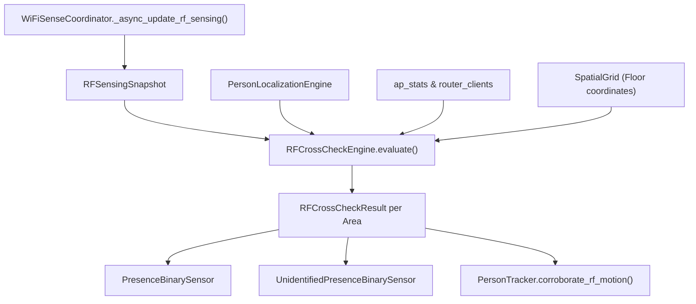

# Backend Plan — Unidentified Presence & RF Cross-Checking

## 1. Architecture Overview
The backend cross-checks RF disturbance events against active person localizations during the coordinator's periodic update and event-driven fast-path.

## 2. Components & Modules to Create / Modify
1. **`custom_components/wifisense_mapper/const.py`**:
   - `CONF_RF_PROXIMITY_THRESHOLD_M` = `"rf_proximity_threshold_m"`, default `3.5`
   - `CONF_RF_COINCIDENCE_WINDOW_S` = `"rf_coincidence_window_sec"`, default `15.0`
   - `CONF_RF_WALL_BLEED_SUPPRESSION` = `"rf_wall_bleed_suppression"`, default `True`
2. **`custom_components/wifisense_mapper/engine/rf_crosscheck.py`**:
   - New engine module implementing the cross-check arbiter.
   - Evaluates each area's RF motion against known persons in the area, wall-bleed persons, and coincidence time windows.
   - Generates `RFCrossCheckResult` per area containing:
     - `unidentified_motion: bool`
     - `occupant_type: str` ("verified" | "unidentified" | "mixed" | "none")
     - `verified_occupants: list[str]`
     - `unidentified_count: int`
     - `rf_corroborated_occupant: str | None`
3. **`custom_components/wifisense_mapper/coordinator.py`**:
   - Instantiates `RFCrossCheckEngine`.
   - Runs cross-checking at the end of `_async_update_rf_sensing()`.
   - Stores `crosscheck_snapshot` in coordinator data.
   - Invokes `corroborate_rf_motion()` on matched person trackers.
4. **`custom_components/wifisense_mapper/binary_sensor.py`**:
   - Updates `PresenceBinarySensor` to consume `crosscheck_snapshot` for its state and attributes.
   - Adds `WiFiSenseUnidentifiedPresenceBinarySensor` for each area.
5. **`custom_components/wifisense_mapper/engine/localization.py`**:
   - Adds `corroborate_rf_motion(ts: float)` to `PersonTracker` that resets standby decay, boosts confidence to 1.0, and sets activity to `STATE_WALKING`.
6. **`strings.json` & `translations/en.json`**:
   - Add localization strings for `unidentified_presence` and new config flow options.
