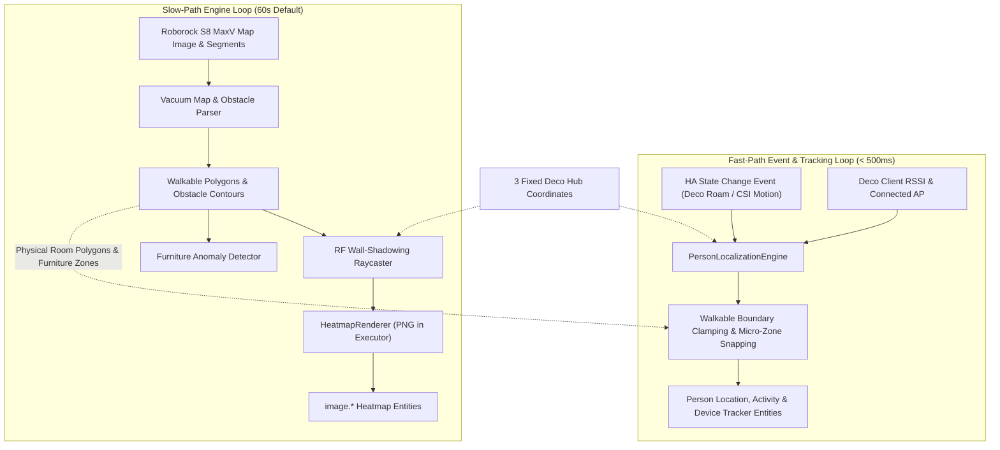

# PRD — Vacuum Map Spatial Fusion & Dual-Interval Engine

## 1. Executive Summary & Goals
This feature upgrades **WiFiSense Mapper** from an abstract free-space spatial model to a physically-grounded spatial intelligence engine. By fusing the **Roborock S8 MaxV** vacuum map (room boundaries, walls, and recognized furniture) with fixed **TP-Link Deco mesh anchors**, it provides:
1. **Sub-second Event-Driven Presence & Micro-Zone Tracking**: Immediate updates when Android devices roam or move, decoupling real-time tracking from heavy background tasks.
2. **Physically Grounded Localization**: Replaces pseudo-random angle generation with multi-AP RF path loss constrained to Roborock walkable room polygons.
3. **Automatic Furniture Micro-Zones**: Uses Roborock furniture detections (sofa, bed, dining table, desk) as spatial attractors for micro-zone classification.
4. **Obstacle-Aware RF Heatmaps**: Renders walls and furniture shadowing rather than generic circular signal heatmaps.

---

## 2. Architecture & Components

---

## 3. Key Specifications

### 3.1 Dual-Interval Architecture
- **Fast-Path**:
  - Listens to HA state change events (`async_track_state_change_event`) for:
    - Tracked device trackers / router clients (IP, AP MAC, RSSI changes).
    - CSI motion sensors (`sensor.*_motion_score`, `binary_sensor.*_presence`).
  - Re-evaluates target person tracker state immediately (< 200ms) without triggering executor jobs or PNG rendering.
- **Slow-Path**:
  - Configurable polling interval (default **60 seconds**, range 10–3600s).
  - Fetches Roborock map PNG bytes, re-indexes obstacles, updates baseline EWMA, and renders 5 PNG heatmap layers.

### 3.2 Fixed Deco Radio Anchors
- Allows positioning the 3 Deco mesh hubs with known coordinates `(x_m, y_m)` or normalized percentages `(x_pct, y_pct)` on the floor grid.
- Each Deco hub serves as a fixed reference point with known transmit power and room assignment.

### 3.3 Roborock Map & Furniture Extraction
- Parses the Roborock map image / segment attributes:
  - **Room Polygons**: Walkable perimeter for each room/area.
  - **Furniture Contours**: Clusters corresponding to sofas, desks, dining tables, and beds.
  - **Dock Coordinates**: Fixed reference landmark on the floor.
- Automatically maps detected furniture clusters to `MicroZone` objects with a 1.2m–1.8m snapping radius.

### 3.4 Spatial Triangulation & Localization
- Path loss distance model:
  $$d = 10^{\frac{P_{tx} - RSSI}{10 \cdot n}}$$
  where $n$ is adjusted dynamically based on line-of-sight wall intersections.
- Kalman filter coordinates are constrained inside the room boundary associated with the connected Deco.
- If speed $< 0.25\text{ m/s}$ and position is within proximity of a recognized furniture micro-zone, status snaps to:
  - *Micro-Zone*: `Living Room Sofa` / `Office Desk`
  - *Activity*: `Stationary / Sitting`

---

## 4. Acceptance Criteria (DoD)
1. **Latency**: Phone roaming between Deco APs updates the `sensor.*_person_location` within < 1.0 second.
2. **Micro-Zone Matching**: A stationary device in the vicinity of mapped furniture correctly reports the furniture name as `micro_zone`.
3. **Boundary Safety**: Estimated coordinates never fall outside the room's physical walls.
4. **Heatmap Quality**: Heatmap images reflect wall attenuation boundaries matching the Roborock floorplan.
5. **CPU Overhead**: Background 60s loop uses executor threads for image rendering; HA event loop remains unblocked.
