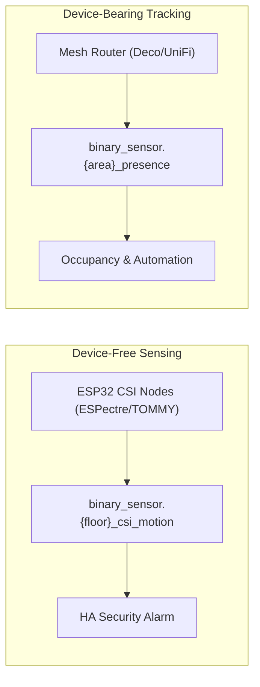

# Connecting to Home Assistant Security & Alarm Systems

WiFiSense Mapper turns your existing WiFi infrastructure and ESP32 CSI nodes into an ambient, device-free motion and intrusion detection layer.

---

## 1. How WiFi Sensing Works for Security

There are two distinct types of sensing in this integration:



1. **Device-Free Motion Detection (`binary_sensor.{floor}_csi_motion`)**:
   * Uses WiFi Channel State Information (CSI) from ESP32 nodes (ESPectre or TOMMY).
   * Detects human movement via RF reflections and Doppler shifts — **no phone, wearable, or tag required**.
   * Ideal for whole-room or floor intrusion triggers.
2. **Device Presence (`binary_sensor.{area}_presence`)**:
   * Tracks WiFi devices associated with specific access points.
   * Useful for verifying family member presence or automating arm/disarm triggers.
3. **Object Anomaly Detection (`binary_sensor.{floor}_object_anomaly`)**:
   * Detects physical environment shifts (e.g. doors opened, furniture moved, large unusual objects).

---

## 2. Integration with HA Alarm Systems (e.g., Manual Alarm or Alarmo)

Because entities use standard HA device classes (`motion`, `presence`, `problem`), they work seamlessly with the [Manual Alarm Control Panel](https://www.home-assistant.io/integrations/manual/) or [Alarmo](https://github.com/nielsfaber/alarmo).

### Example 1: Intrusion Alarm Trigger when Armed Away

Trigger your alarm system when human motion is detected by CSI sensing on any floor:

```yaml
alias: "Security: WiFiSense Intrusion Alarm"
description: "Triggers home alarm if motion is sensed while armed away"
trigger:
  - platform: state
    entity_id:
      - binary_sensor.ground_floor_csi_motion
      - binary_sensor.first_floor_csi_motion
    to: "on"
condition:
  - condition: state
    entity_id: alarm_control_panel.home_alarm
    state: "armed_away"
action:
  - service: alarm_control_panel.alarm_trigger
    target:
      entity_id: alarm_control_panel.home_alarm
  - service: notify.notify
    data:
      title: "🚨 Intrusion Detected!"
      message: "WiFiSense detected human motion on {{ trigger.to_state.name }}."
      data:
        image: "/api/image_proxy/image.ground_floor_motion_heatmap"
```

---

### Example 2: Push Notification with Anomaly Heatmap Snapshot

Send an actionable mobile notification with the spatial heatmap attached if an anomaly or obstacle is detected:

```yaml
alias: "Security: Notify on Spatial Signal Anomaly"
trigger:
  - platform: state
    entity_id: binary_sensor.ground_floor_object_anomaly
    to: "on"
condition:
  - condition: state
    entity_id: alarm_control_panel.home_alarm
    state:
      - "armed_away"
      - "armed_night"
action:
  - service: notify.mobile_app_phone
    data:
      title: "⚠️ WiFi Spatial Anomaly Detected"
      message: "Unexpected RF distortion detected on the ground floor."
      data:
        attachment:
          url: "/api/image_proxy/image.ground_floor_anomaly_heatmap"
          content-type: "png"
```

---

### Example 3: Auto-Disarm / Welcome Home Automation

Disarm the alarm or turn on hallway lights when a family member's phone connects to the foyer/ground floor AP:

```yaml
alias: "Presence: Welcome Home on WiFi Reconnect"
trigger:
  - platform: state
    entity_id: binary_sensor.entryway_presence
    to: "on"
condition:
  - condition: state
    entity_id: alarm_control_panel.home_alarm
    state: "armed_home"
action:
  - service: light.turn_on
    target:
      entity_id: light.entryway_lights
```

---

## 3. Best Practices for Minimizing False Alarms

* **Baseline Warm-Up**: Allow the baseline learner to gather data for at least 48 hours (ideally 7 days) before attaching `binary_sensor.{floor}_object_anomaly` to an audible siren.
* **Sensitivity Tuning**: If you experience false alerts, adjust the **Anomaly Threshold** in `Settings → Devices & Services → WiFiSense Mapper → Configure` (raising it from `3.0` to `4.0` or `5.0`).
* **Pets**: Large pets moving close to ESP32 CSI nodes can produce motion scores. Place nodes at chest height (~1.0–1.2 m) to reduce ground-level pet sensitivity.
* **Redundancy**: For high-security zones, combine `binary_sensor.{floor}_csi_motion` with traditional PIR or mmWave radar sensors using an HA template sensor or Alarmo sensor groups.
