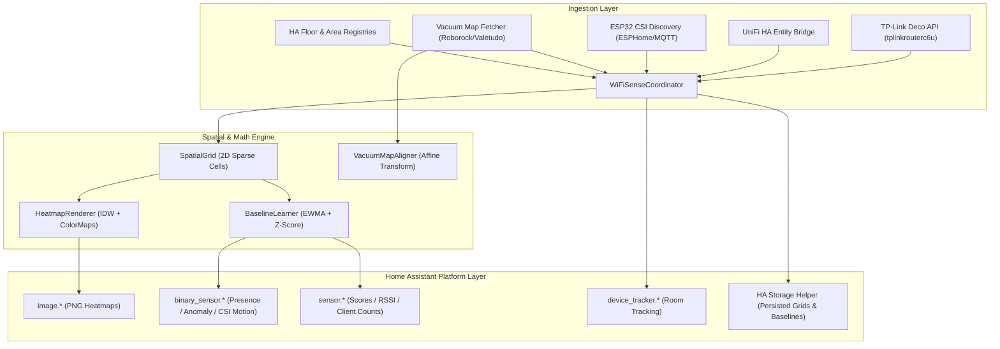

# Technical Details & Architecture

This document provides deep technical details on the algorithms, spatial rendering pipeline, dashboard integrations, and architecture of WiFiSense Mapper.

---

## 1. System Architecture



---

## 2. Spatial Engine & Mathematical Algorithms

### 2.1 Sparse 2D Spatial Grid (`engine/grid.py`)
* The integration initializes a 2D sparse grid per floor with a default resolution of **0.5 meters per cell**.
* Each cell stores:
  * Running mean RSSI and variance.
  * CSI motion score accumulation with exponential distance decay ($e^{-\lambda d}$).
  * AP association weights.

### 2.2 Heatmap Rendering & Interpolation (`engine/heatmap.py`)
* **Inverse Distance Weighting (IDW)**: Computes continuous field values between discrete measurement points:
  $$u(x) = \frac{\sum_{i=1}^N w_i(x) u_i}{\sum_{i=1}^N w_i(x)}, \quad w_i(x) = \frac{1}{d(x, x_i)^p}$$
* **Layer Rendering**:
  * **Signal**: Viridis-style gradient (blue $\to$ green $\to$ yellow).
  * **Variance**: Plasma-style gradient highlighting signal multipath and shadow boundaries.
  * **Motion**: Hot colormap (black $\to$ red $\to$ yellow) for Doppler movement.
  * **Anomaly**: Alpha-blended red overlay targeting cells with $z > \text{threshold}$.
* **Offloaded to Thread Executor**: Heavy NumPy and Pillow image operations run via `hass.async_add_executor_job` to guarantee 0 ms blocking on the HA event loop.

### 2.3 Baseline Learning & Anomaly Detection (`engine/baseline.py`)
* **Exponentially Weighted Moving Average (EWMA)**:
  $$\mu_t = \alpha x_t + (1 - \alpha) \mu_{t-1}$$
  $$\sigma_t^2 = \alpha (x_t - \mu_t)^2 + (1 - \alpha) \sigma_{t-1}^2$$
* **Statistical Z-Score**:
  $$z = \frac{|x_t - \mu_t|}{\sigma_t}$$
* When $z > \text{threshold}$ across anomalous cells, `binary_sensor.{floor}_object_anomaly` turns `on`.

### 2.4 Vacuum Coordinate Alignment (`engine/vacuum_align.py`)
* Uses a 2D Affine Transformation matrix ($3 \times 3$) computed via least-squares over $\ge 3$ non-collinear calibration points:
  $$\begin{bmatrix} x_{grid} \\ y_{grid} \\ 1 \end{bmatrix} = \begin{bmatrix} a & b & t_x \\ c & d & t_y \\ 0 & 0 & 1 \end{bmatrix} \begin{bmatrix} x_{vac} \\ y_{vac} \\ 1 \end{bmatrix}$$

---

## 3. Lovelace Dashboard Visualization

### Picture-Elements Card (Overlay with Transparency)
Overlay the heatmap PNG directly on top of your 2D architectural floorplan:

```yaml
type: picture-elements
image: /local/floorplans/ground_floor.png
elements:
  # Signal Heatmap Overlay
  - type: image
    entity: image.ground_floor_signal_heatmap
    style:
      left: 0%
      top: 0%
      width: 100%
      opacity: 0.55
      pointer-events: none

  # Room Presence Badges
  - type: state-badge
    entity: binary_sensor.living_room_presence
    style:
      left: 28%
      top: 42%

  - type: state-badge
    entity: binary_sensor.kitchen_presence
    style:
      left: 65%
      top: 30%
```

### 3D Floorplans (Zircon3D / Floorplan / Sweet Home 3D)
Use the `export_map` service in an automation to save exported PNGs to `/config/www/wifisense_{floor}_{layer}.png`. Reference this texture dynamically in 3D canvas renderers.

---

## 4. Performance & Resource Constraints

* **Non-Blocking Execution**: All network I/O, router requests, and image rendering are strictly asynchronous or offloaded to background threads.
* **Low CPU Footprint**: On Raspberry Pi 4 / Home Assistant Green, CPU overhead is typically `< 1-2%`.
* **State Persistence**: Spatial grids, calibration matrices, and baseline weights are automatically saved to HA JSON storage (`homeassistant.helpers.storage`) every 15 minutes and upon integration unload.
